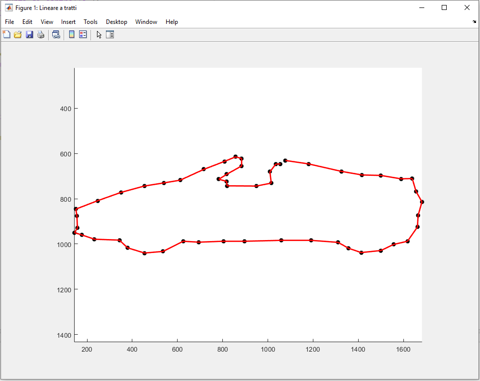
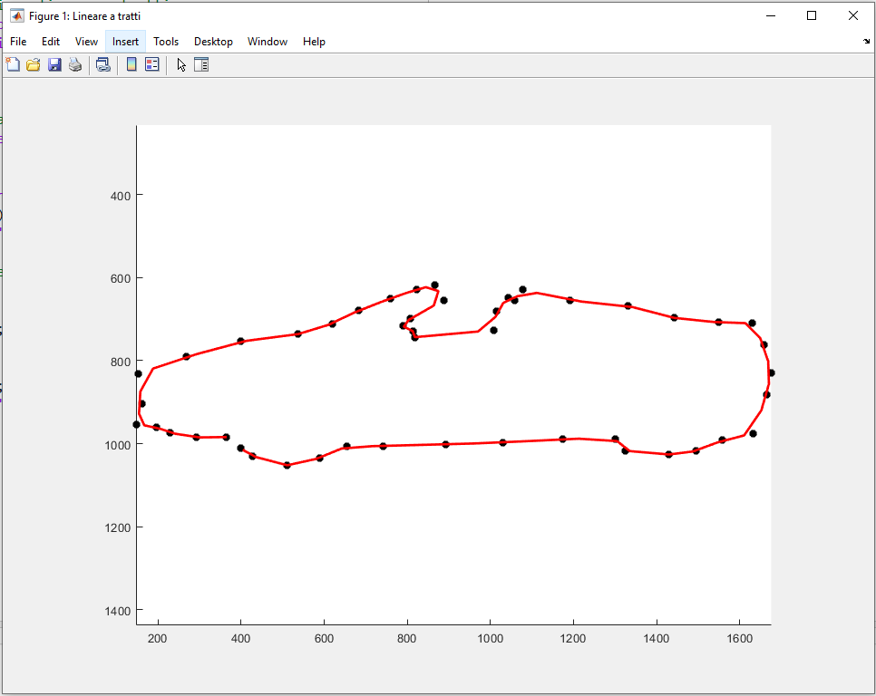
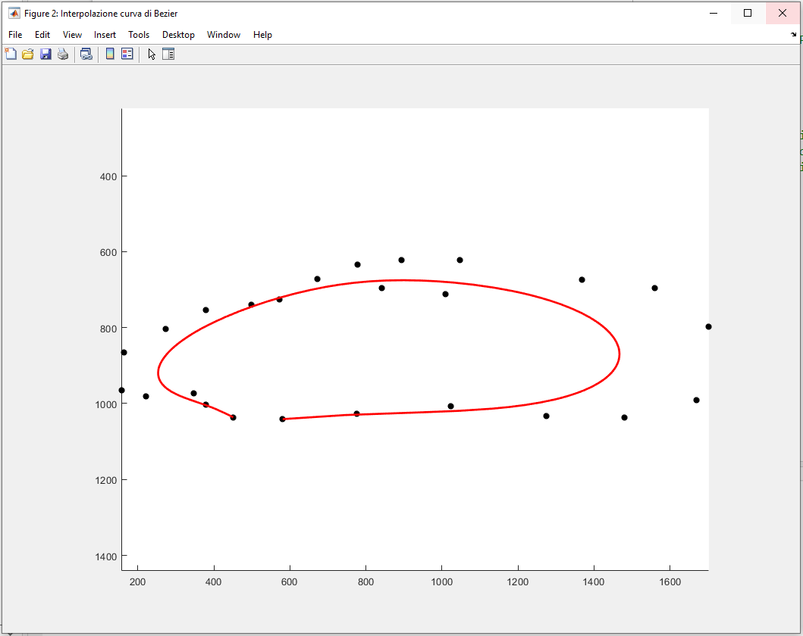
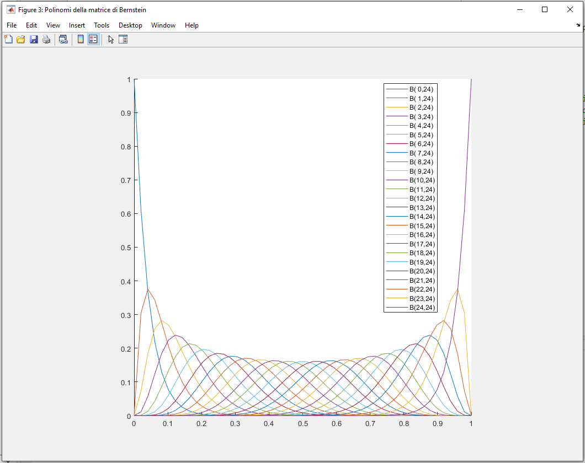
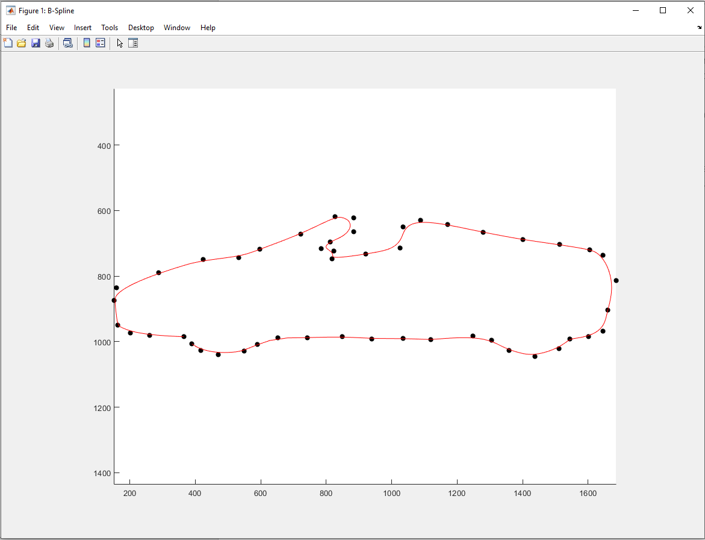
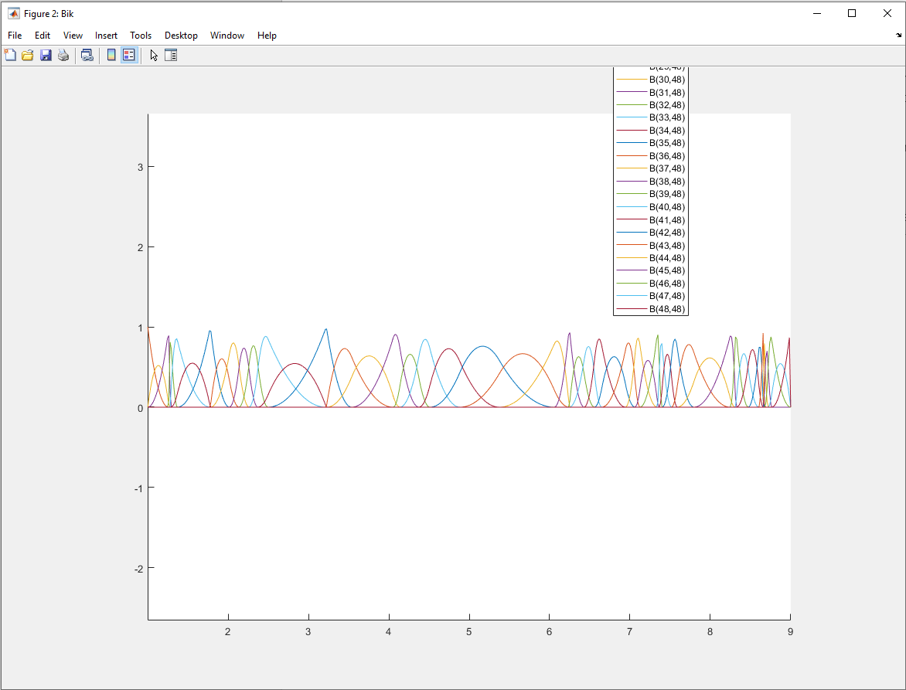
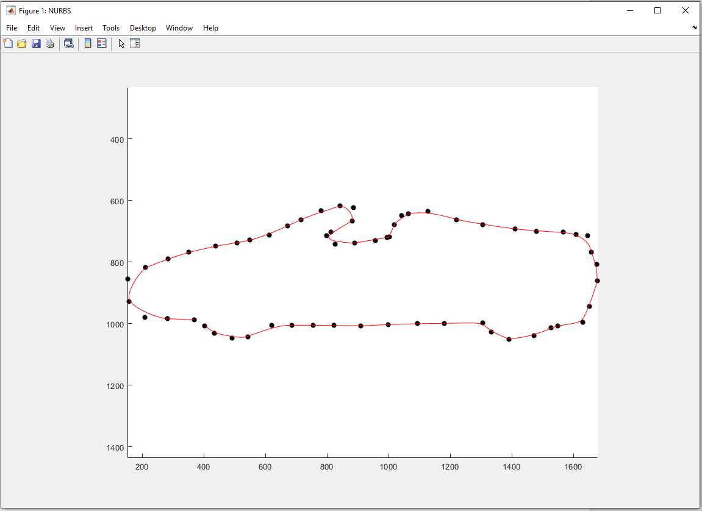
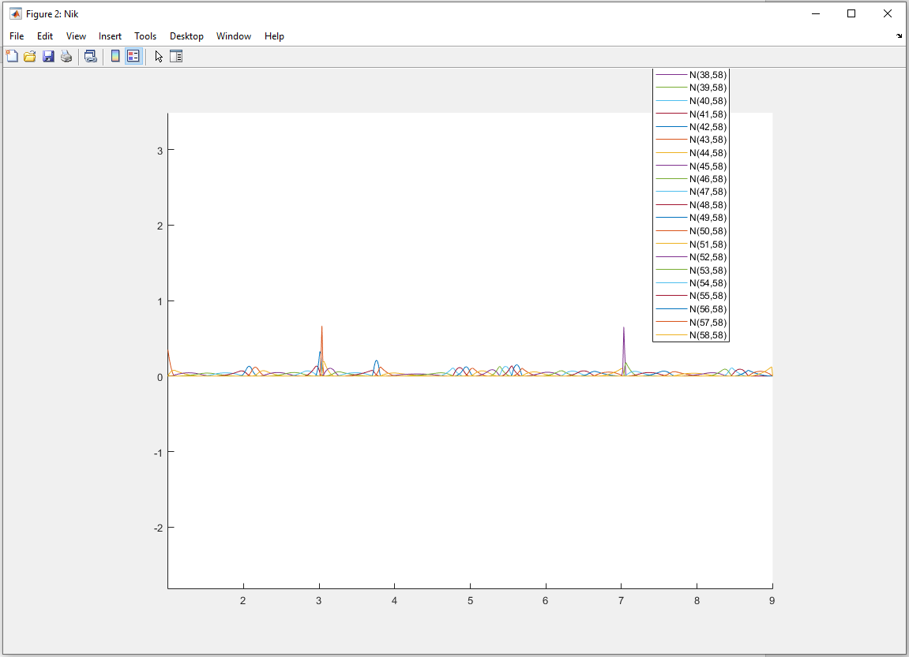

# Modellazione Grafica e Image Fitting – Toolkit di Interpolazione in MATLAB

Questo progetto è incentrato sulla **modellazione grafica** e sulle **tecniche di interpolazione** per il fitting di curve, utilizzando metodi come **interpolazione lineare a tratti**, **curve di Bézier**, **B-Spline** e **NURBS (Non-Uniform Rational B-Splines)**.  
Include sia implementazioni teoriche che una **applicazione MATLAB con interfaccia grafica** per sperimentare e visualizzare i risultati in modo interattivo.

---

## 📌 Descrizione del Progetto

Negli ultimi decenni, l’evoluzione tecnologica ha trasformato radicalmente il modo in cui raccogliamo, analizziamo e rappresentiamo i dati. In ambiti come scienza, ingegneria, medicina, arte e intrattenimento, è fondamentale rappresentare graficamente e modellare con precisione l’andamento dei dati.

Questo progetto affronta il problema dell’**adattamento di curve a punti di controllo** selezionati su un’immagine di riferimento, attraverso diversi modelli matematici:

- **Interpolazione lineare a tratti**
- **Curve di Bézier**
- **Curve B-Spline**
- **Curve NURBS**

Ogni metodo è implementato in MATLAB tramite script dedicati ed è integrato in una GUI per un utilizzo semplice e intuitivo.

---

## 🛠 Modelli Implementati

### 1. Interpolazione Lineare a Tratti

- **Script:** `lineare_a_tratti.m`
- Permette di selezionare punti di controllo su un'immagine.
- Utilizza la funzione `interp1` per l'interpolazione lineare.
- Lo step è regolabile e influisce sulla continuità della curva.

### 2. Curva di Bézier

- **Script:** `bezier_curve.m`
- Utilizza i polinomi di Bernstein per interpolare i punti di controllo.
- Viene generato anche il grafico dei polinomi di base.

### 3. B-Spline

- **Script:** `bspline_curve.m`
- Implementazione basata sull’**algoritmo di de Boor** (`bspline_deboor_fun.m`).
- Viene mostrata sia la curva risultante sia le funzioni di base (`bspline_funzioni_base_fun.m`).

### 4. NURBS

- **Script:** `nurbs.m`
- Estensione delle B-Spline tramite l’utilizzo di **pesi** per i punti di controllo.
- Calcolo a cura della funzione `nurbs_deboor_fun.m`.
- Sono mostrati i plot della curva e delle funzioni di base pesate e normalizzate.

---

## 🧪 Utilizzo

### Requisiti

- **MATLAB** (testato su R2023a o versioni successive)
- Nessun toolbox aggiuntivo richiesto

### Esecuzione degli Script

Ogni modello può essere testato singolarmente eseguendo uno dei seguenti file nella cartella _interpolation_models_:

```matlab
lineare_a_tratti.m
bezier_curve.m
bspline_curve.m
nurbs.m
```

Ogni script:

- Carica un’immagine (`Ferrari_488_Spider.jpg` di default)
- Consente la selezione dei punti di controllo
- Visualizza la curva interpolata e le funzioni di base associate

---

## 🖥 Applicazione con Interfaccia Grafica

Per un'esperienza più interattiva, è disponibile una GUI MATLAB nella cartella _matlab_app_:

- **Apri il file:** `app1.mlapp`
- **Oppure installa l’app:** eseguendo il pacchetto `Segmentazione2D.mlappinstall`

Interfaccia:

<p align="left">
  
</p>

La GUI permette di:

- Caricare un’immagine
- Selezionare i punti di controllo
- Applicare i vari modelli di interpolazione
- Visualizzare i risultati in tempo reale

---

## 📷 Esempi di Output

### 🔸 Interpolazione lineare con step 0.1 e 0.9

<p align="center">
  
  
</p>

### 🔸 Curva di Bézier + Polinomi di Bernstein

<p align="center">
  
  
</p>

### 🔸 Curve B-Spline + Funzioni di base

<p align="center">
  
  
</p>

### 🔸 Curve NURBS + Funzioni pesate e normalizzate

<p align="center">
  
  
</p>

---

## 👥 Autori

- Francesco Scognamiglio
- Felice Micillo
